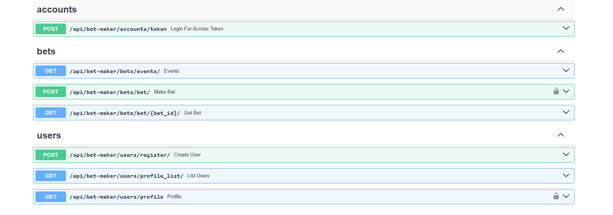
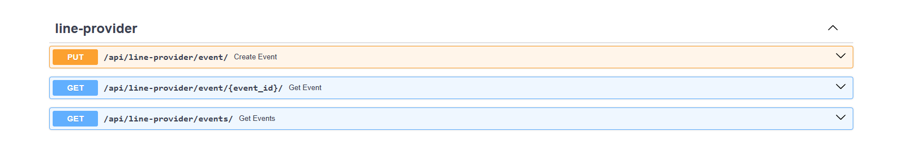

# betting-microservices
## Get started


### ◦ Виртуальное окружение

Создайте виртуальное окружение. 

```commandline
python -m venv venv
```

> Здесь используется утилита "venv" для создания виртуального окружения, но вы в праве использовать любой другой инструмент (к примеру virtualenv).


### ◦ Переменные окружения

В данном проекте вам необходимо использовать переменные окружения. Это данные, которые вы записываете в файл .env, чтобы скрыть информацию от ненужных глаз. 

Скопируйте содержимое .env.example и подставьте нужные значения.

```commandline
cp .env.example .env
```

## База
В качестве базы используется Postgresql. Так что, перед запуском пректа нужно создать базу.


## Запуск через докер

В данном проекте вы можете запустить проект через докер.

```commandline
docker-compose build
```

Затем запустите проект через докер композ

```commandline
docker-compose up
```

Данные окружения для жокера с env записаны в файле .env в директории .envs

## Эндпоинты

Данный проект состоит из двух проектов - 1) line-provider 2) bet-maker

В docker-compose используется nginx для более удобной работы с приложениям.

### bet-maker
базовый url: http://localhost:8080/api/bet-maker/

docs: http://localhost:8080/api/bet-maker/docs/



базовый url: http://localhost:8080/api/line-provider/

docs: http://localhost:8080/api/line-provider/docs/
## line-provider


## Работа проекта
<code><b>line-provider</b></code> не требует авторизации, предназначен для получения ставок и создания событий.
Можно создать/обновить событие - [PUT] api/line-provider/event  
получить список событий - [GET] api/line-provider/events   
или получить событие по айди - [GET] api/line-provider/event/{event_id}

<code><b>bet-maker</b></code> требует авторизации для создания ставок. 
Регистрация не требует авторизации, поэтому можно зарегистрировать пользователя по эндпоинту - [POST] /api/bet-maker/users/register/  
Для аутентикации пользователя используется JWT Token, можно использовать его в савггере, также и в headers. 
Для получения токена можно испотзовать - [POST] /api/bet-maker/accounts/token. Или воспользоваться возмжностью авторизации через сваггер Authorize

Можно получить события ставок по адресу - [GET] /api/bet-maker/bets/events/ <br>
Данный эндпоинт получает ставки с <code><b>line-provider</b></code>

После создать ставки на полученные данные по адресу - [POST] /api/bet-maker/bets/bet/
Создание требует event_id и сумму ставки

Не хватает логики по обновлению статуса ставок с <code><b>line-provider</b></code> по истечению срока.
Все данные события (Event) также хранятся в ставках (Bet)
